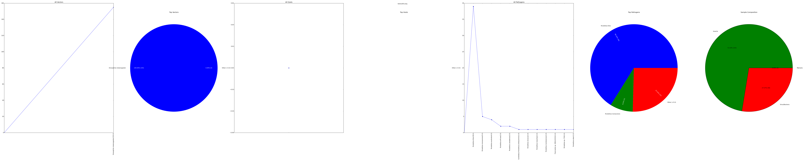

========
make_pie
========

Creates a graphic for each supplied project based on all of the .top.blast.phylo files found in both the
iterative_blast_phylo output directories.
Likely these counts will not reflect all your input reads as the host_map stage typically runs prior to these
and will remove reads that mapped to your host

The graphic depicts sample compisition in the form of 4 pie graphics depicting:

* Vector composition
* Host composition
* Pathogen composition
* Sample composition

Example
=======

This example was built using the testoutDir created via the example in the :doc:`../install`

.. code-block:: bash

    make_pie testoutDir

This will create a directory called host_vector_pathogen inside of the current directory. Inside of that directory
you will find the file testoutDir.png that looks like this:

Vector Composition
==================

Based on the class field and only includes Insecta

Host Composition
================

Based on the class field and only includes Mammalia

Pathogen Composition
====================

Based on the superkingdom field and only includes Bacteria and Viruses

Sample Composition
==================

Overview that shows Host, Vector and Pathogen composition as a whole for the sample

Files Used from analysis
========================

* results/iterative_blast_phylo*/\*.top.blast.phylo

How phylo files are used
========================

* Grab all results/iterative_blast_phylo_*/\*.top.blast.phylo files
* Each File is opened and read line
* Line is split by tab and columns 1, 2, 4 and 8 (0-indexed) are used
  * 1 -> Count
  * 2 -> super kingdom
  * 4 -> class
  * 8 -> species
* A mapping of vectors, hosts and pathogens is created based on each found species
* If class matches Mammalia
  * increment count for host
  * increment mapping count for hosts[species]
* If class matches Insecta
  * increment count for vectors
  * increment mapping count for vectors[species]
* If superkingdom matches Viruses or Bacteria
  * increment count for pathogens
  * increment mapping count for pathogens[species]
* You now have counts for the following
  * total hosts, total hosts by species via mapping
  * total vectors, total vectors by species via mapping
  * total pathogens, total pathogens by species via mapping
  * hosts + vectors + pathogens = total overall

*Note*: If the species is not set for a line then columns to the left will be searched until a non dash column is found and that will be used for the species

Each pie graphic is created by looking through the created mappings and using the keys(species) for the pie slice labels and the counts associated to those species for the values
